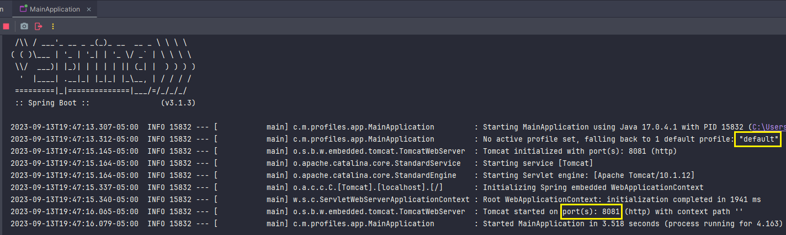
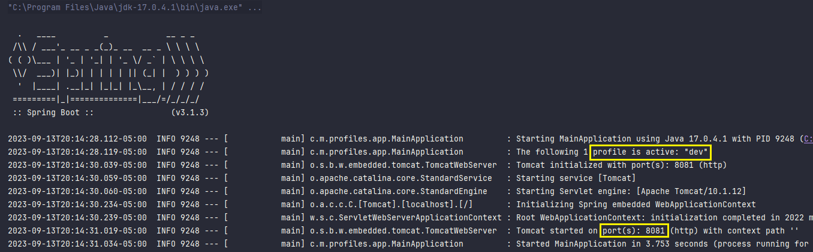
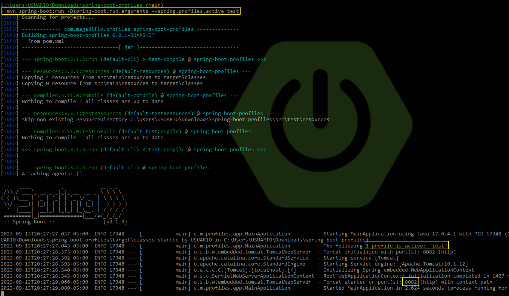

# Perfiles en Spring Boot

Fuente: [javatechonline](https://javatechonline.com/profiles-in-spring-boot/?fbclid=IwAR1Etc8VN0AAfmvPSD4dau-OzzP6HVnu5cO4hhUjBZvwnW2B5YQ4O9o6_hU)

---

## ¿Qué es el perfil predeterminado?

Spring Boot viene con un archivo de propiedades, llamado archivo `application.properties` de forma predeterminada
**(default)**. Por lo tanto, `este archivo es el perfil predeterminado, es el perfil por default`. Del mismo modo,
el archivo `application.yml` también será el perfil predeterminado. `El perfil predeterminado siempre está activo`.

`Spring Boot carga primero todas las propiedades del perfil predeterminado`.

Si una propiedad se define en el perfil predeterminado, pero no en el perfil prod, el valor de la propiedad se rellenará
a partir del perfil predeterminado. Esto es muy útil para definir valores predeterminados que son válidos en todos los
perfiles. Por lo tanto, **debemos mantener todas las propiedades en el perfil predeterminado
** (`application.properties`) que son **comunes en todos los perfiles**.

**Perfil por default:** `application.properties`

````properties
server.port=8081
````

Si ejecutamos, tan solo teniendo el perfil por defecto `application.properties` en la aplicación, veremos lo siguiente:



El resultado muestra que al no tener más perfiles en la aplicación y además al no haber establecido uno en particular,
el perfil por default es el que se usa.

## ¿Cómo crear un perfil en Spring?

En lugar de estar cambiando constantemente las entradas en el `perfil predeterminado (por default)`, **crearemos un
archivo dedicado independiente para cada entorno**. Además, podemos **activar el perfil requerido** cambiando solo una
entrada en **el perfil por default**.

Supongamos que tenemos tres entornos, tales como: `development`, `production` y `test`, así que, crearemos tres archivos
de propiedades más en la misma ubicación donde reside el archivo `application.properties`, al final tendremos la
siguiente estructura:

````
src/main/resources/
    application.properties          <-- default
    application-dev.properties      <-- development
    application-prod.properties     <-- production
    application-test.properties     <-- test
````

Debemos **tener en cuenta la convención de la nomenclatura**. A continuación se muestra para los dos tipos de archivos
`.properties` y `.yml`:

> `application-<entorno>.properties`
>
> `application-<entorno>.yml`

**DONDE**

El `<entorno>` puede tomar cualquier nombre, en mi caso nombré a los entornos: `dev`, `prod` y `test`.

Ahora, insertemos algunas propiedades de configuración en estos archivos. Por ejemplo, agregaremos configuraciones
de bases de datos que son diferentes en cada archivo `(estas configuraciones serán a modo de prueba, no son
configuraciones propias de las bases de datos)`. Supongamos que la BD h2 es para desarrollo, MySQL para prueba y
Oracle DB para producción:

**Perfil development:** `application-dev.properties`

````properties
app.info=Este es el archivo de propiedades del entorno dev
base.datos.h2.console.enabled=true
base.datos.h2.console.path=/h2
base.datos.fuente.driver-class-name=org.h2.Driver
base.datos.fuente.url=jdbc:h2:mem:db
base.datos.fuente.usuario=sa
base.datos.fuente.password=sa
````

**Perfil test:** `application-test.properties`

````properties
app.info=Este es el archivo de propiedades del entorno test
base.datos.fuente.url=jdbc:mysql://localhost:3306/myTestDB
base.datos.fuente.usuario=root
base.datos.fuente.password=123
base.datos.fuente.driver-class-name=com.mysql.cj.jdbc.Driver
base.datos.jpa.hibernate.ddl-auto=update
base.datos.jpa.properties.hibernate.dialect=org.hibernate.dialect.MySQL5Dialect
````

**Perfil production:** `application-prod.properties`

````properties
app.message=Este es el archivo de propiedades del entorno prod
base.datos.fuente.url=jdbc:oracle:thin:@localhost:1521:xe
base.datos.fuente.usuario=username
base.datos.fuente.password=password
base.datos.jpa.hibernate.ddl-auto=update
base.datos.jpa.show-sql=true
base.datos.fuente.driver-class-name=oracle.jdbc.OracleDriver
base.datos.jpa.properties.hibernate.dialect=org.hibernate.dialect.Oracle10gDialect
````

Si no implementamos perfiles, tendremos que acomodar todas las entradas anteriores en un solo archivo
`application.properties`. Además, si queremos cambiar a un perfil diferente, tendremos que hacer muchos cambios cada
vez. Por lo tanto, mantener un perfil separado para cada entorno ahorra mucho esfuerzo.

## ¿Cómo activar un perfil en particular?

Aunque, tenemos múltiples formas de hacer que un perfil en particular sea activo. Discutamos algunos de ellos uno por
uno.

### Enfoque n° 1: Configurando `spring.profiles.active` en `application.properties`

El archivo `application.properties` **será el jefe entre todos los archivos de propiedades**. Aquí especificaremos qué
perfil está activo estableciendo el valor de la propiedad `spring.profiles.active`. Por ejemplo, a continuación el
archivo `application.properties` nos indica que actualmente el perfil "development (dev)" está activo.

**Perfil por default:** `application.properties`

````properties
spring.application.name=Perfiles en Spring
server.port=8081
spring.profiles.active=dev
app.info=Este es el archivo de propiedades por default
````

En el código anterior, el valor de la propiedad `spring.profiles.active` **indica a Spring qué perfil usar**.
Aquí hemos establecido el perfil de desarrollo como activo. **Este es el enfoque más comúnmente utilizado para hacer
que un perfil particular sea activo.**

**¡Importante!**, el valor de la configuración `spring.profiles.active` tiene que ser el nombre del `<entorno>` que le
dimos al archivo de propiedades.

Si ejecutamos la aplicación, ahora veremos que Spring selecciona el perfil que fue configurado: `dev`.



### Enfoque n° 2: Configurando el parámetro del sistema JVM

También podemos pasar el nombre del perfil en un parámetro del sistema JVM como se muestra a continuación. **El perfil
especificado se activará durante el inicio de la aplicación.**

En nuestro caso, para ejemplificar este enfoque nos posicionaremos mediante una terminal en la raíz de nuestra
aplicación, y ejecutaremos nuestro proyecto con el siguiente comando (note que estamos especificando el perfil que
queremos que se active, en este caso es el `test`):

````bash
mvn spring-boot:run -Dspring-boot.run.arguments=--spring.profiles.active=test
````


